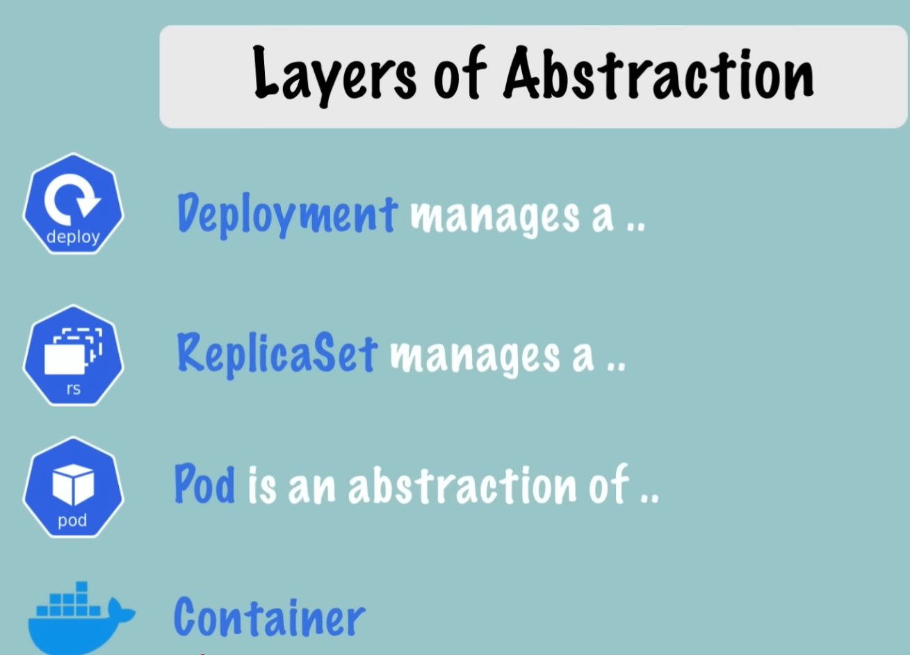

# K8s Notes (Part 1: BASICS)

## What is Kubernetes (K8s) ?
K - U B E R N E T E (8 characters) - S = k8s

similar to: Internationalisation (i18n) and Localisation (l10n)

Below Image shows how we moved from directly deploying on OS to Virtualized Deployments to Container Deployment Architecture (via Docker).

ref: https://kubernetes.io/docs/concepts/overview/

Even with Container Deployment, If our application has multiple services, and deployed across multiple servers, it is still difficult to manage. That's where k8s helps us.

> _Kubernetes is a portable, extensible, open source platform for managing containerized workloads and services that facilitate both declarative configuration and automation. It has a large, rapidly growing ecosystem. Kubernetes services, support, and tools are widely available._

You might be wondering, we already have docker compose and AWS ECS, then why do we need it?

We need k8s because docker compose is not mature enough to manage deployments across multiple machines with full confidence and control. Also, solutions like AWS ECS are provided by Cloud Providers. So, we face the problem of "Vendor Lockin" and k8s being fulling open, we can easily modify any of the component.

## K8s Philosophy
Based on my study and observations, I have prepared following list of principles k8s follows:

1. Almost Everything in K8s is a object with a type (referred to as `kind` of object). We create an object (example: Deployment) with a desired state and K8s make sure the desired state is achieved. In case of failure, k8s is responsible for updating the state automatically instead of us tracking and creating new deployment manually.

2. k8s is fully open source. We can easily modify any of the layer in control plane and switch it with our own custom layer. This helps us to not just manage the deployments but also use k8s as our own state management service. For example: We can create CRDs and can create custom kind and objects which represents data in our application. Then we can manage the state with help of events. K8s will make sure our state is correct at all times and based on events (received via api server), it can interact with other CRDs (maybe external service as per requirements) and update our objects. In simple words, the state of data object present in k8s can be single source of truth at all times.

## K8s Architecture
Below image shows the core components in a kubernetes applications.

Here, user sends commands via control plane. Those commands updates object desired states in etcd database. Then all worker nodes keeps pulling latest state from control plane and updates itself based on changes.

> Note: this design is different from other deployment flows. In other Deployment Flows, master node is responsible for doing the heavy work of managing nodes by sending them new states. But in case of k8s, worker nodes (slave nodes) pulls the state from master node/control plane and updates itself. That's why Kubernetes provides eventual consistency instead of strong consistency as provided by other solutions.

## Main K8s Components

(Everything below Deployment should be automatically managed by Kubernetes)

### 1. Node
Node Represents a physical machine/virtual machine on cloud. It contains k8s specific services (kubelet and kube-proxy) at all times. It also includes container environment by default. A single node can contain multiple Pods.

### 2. Pod
A pod encapsulates application containers, storage resources, a unique network ID and other configuration on how to run the containers. It is usually recommended to run single container inside a pod. Each Pod gets its own IP Address.

### 3. Service
Since pods are volatile, requests from other pods are sent to the service. Service acts as a gateway/middleman which further sends the request to the appropriate Pod. Service has a permanent IP Address. So, it is unaffected by Pods re-deployments.

### 4. Ingress
Ingress refers to the outside traffic coming to our containers. For example: backend api server needs to be exposed to the internet and must accept ingress traffic.

### 5. ConfigMap
This is public configuration (not passwords/secrets) like name & env type (dev, prod, stage) which can be exposed to the container as env file/env vars as plain text.

### 6. Secret
It represents credentials which must be kept private. These are also exposed to the containers as env file/env vars but are further encrypted/decrypted over the network instead of plain text. (TODO: Nana said built in security mechanism is not enabled by default.... carefully check this while trying demo)

### 7. Volumes
It is a local / remote volume attached to the node for persisting state (eg: database).
(TODO: As per Nana, K8s doesn't manage data persistence. We have to manage it.)

### 8. Deployment
We don't create pods directly. Instead, we create deployments. It is basically a blueprint for our pods. K8s manages the deployments and makes sure the spec specified in manifest file for deployment is achieved.

### 9. StatefulSet
We must deploy stateful apps like databases via StatefulSet Only. It is difficult to manage. That's why, databases are also hosted outside k8s.

### 10. Kubelet
Kubelet is a k8s process interacts with both container runtime and node (machine). Kubelet is responsible for taking the requirements and creating pods with containers in a node.

### 11. Kube-proxy
Kube proxy is responsible for redirecting the requests to appropriate node. It implements Kubernetes Services by programming iptables or IPVS rules on each node, enabling load balancing and routing traffic from a Service IP to the appropriate backend Pod. kube-proxy watches changes in master node and updates iptables/ipvs rules accordingly.

### 12. API Server
We interact with the API Server present on master node to send commands. The Kubernetes API server **validates** and configures data for the api objects which include pods, services, replicationcontrollers, and others. The API Server services REST operations and provides the frontend to the cluster's shared state through which all other components interact.

### 13. Scheduler
Scheduler is an intelligent process which decides where received requirement (example: deployment) should be added. It decides which node should run the new pod according to constraints and available resources.

### 14. Kube Controller Manager
The Kubernetes controller manager is a daemon that embeds the core control loops shipped with Kubernetes. It runs multiple controllers.

One of these controller detects state changes (desired state - spec is different from actual state - status) and sends it to scheduler for rescheduling it (example: restarting a pod).
Examples of controllers that ship with Kubernetes today are the replication controller, endpoints controller, namespace controller, and serviceaccounts controller.

> Note: If we create a standalone pod  (kind: Pod), it is not managed by anyone. If it dies, it remains in a Failed (if it crashed) or Unknown (if the node died) state. It stays dead because there is no controller watching it to compare the actual state (0 replicas) with the desired state (1 replica).

### 15. etcd
etcd is a key value store of a cluster state. It acts like a brain and tracks all the changes. Everyone uses etcd for getting details about nodes, states etc.

